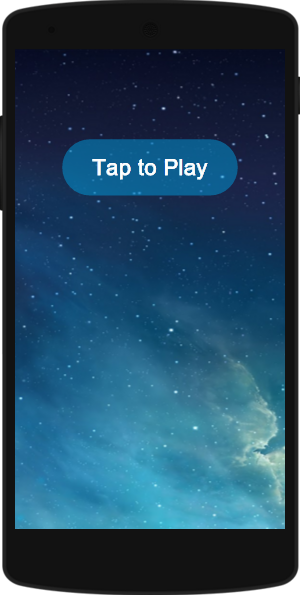

# Podcasts da Bel

** Atenção, este aplicativo encontra-se em desenvolvimento e qualquer erro deve ser reportado no [rastreador de problemas][5]. Obrigado!**

Todos os Podcasts da [Bel Pesce][1] num só lugar. Com este aplicativo você acompanha no celular os podcasts de todos canais da Bel.

Os canais de podcast da Bel Pesce podem ser encontrados no site do [Podcast da Bel][2] e no [SoundCloud][3].

# Showcase
![4]

# Live

# Planejamento (Em desenvolvimento)
O [rastreador de problemas][5] mostra uma lista de características que são planejadas no momento.

# Conhecimento (Em desenvolvimento)
A [wiki][6] contém detalhes de como usar este aplicativo e as funcionalidades fornecidas atualmente.

# Projeto em desenvolvimento por
* Filipe Bezerra - http://filipebezerra.github.io - filipebzerra@gmail.com

[1]: http://belpesce.com.br/
[2]: http://podcastdabel.com.br/
[3]: https://soundcloud.com/belpesce/sets
[4]: https://raw.githubusercontent.com/filipebezerra/Podcasts-Da-Bel/master/art/showcase/Showcase.png
[5]: https://github.com/filipebezerra/Podcasts-Da-Bel/issues
[6]: https://github.com/filipebezerra/Podcasts-Da-Bel/wiki
